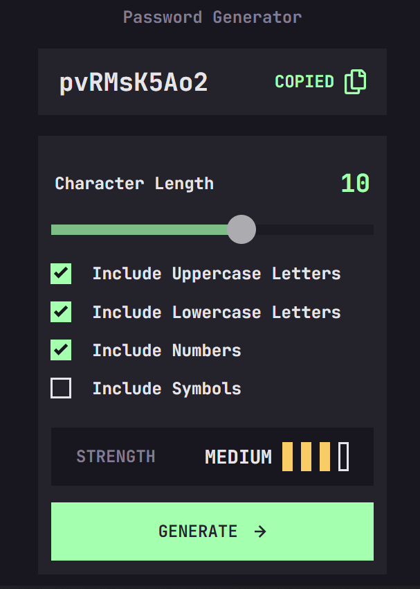

**Password Generator**

## Table of contents

- [Overview](#overview)
  - [Screenshot](#screenshot)
  - [Built with](#built-with)
  - [What I learned](#what-i-learned)
  - [Useful resources](#useful-resources)
- [Author](#author)

## Overview

The following project is a password generator app with custom slider and checkbox.
The main idea is to allow the user to easily generate and copy a password considering the most commom password requirements(length,special characters...);.

Users should be able to:

- Generate a password based on the selected inclusion options
- Copy the generated password to the computer's clipboard
- See a strength rating for their generated password
- View the optimal layout for the interface depending on their device's screen size
- See hover and focus states for all interactive elements on the page

### Screenshot



### Built with

- Semantic HTML5 markup
- CSS custom properties
- Flexbox
- Mobile-first workflow

### What I learned

During the development i was able to learned how to customize checkbox input type and
range input type.
To customize the checkbox the original box is made invisible and a new one is created and recieves the style properties based on the design. Check the section useful resource to get more details.

```html
<label class="container"
  >Include Uppercase Letters
  <input type="checkbox" checked="checked" value="upper" />
  <span class="checkmark"></span>
</label>
```

```css
.container {
  display: flex;
  align-items: center;
  gap: 0.625rem;
  flex-direction: row-reverse;
  -webkit-user-select: none;
  -moz-user-select: none;
  -ms-user-select: none;
  user-select: none;
}
.container input {
  opacity: 0;
  z-index: -1;
  height: 0;
  width: 0;
}
.checkmark {
  display: flex;
  align-items: center;
  justify-content: center;
  aspect-ratio: 1/1;
  width: 1.25rem;
  border: 2px solid var(--font-color);
  cursor: pointer;
}
.checkmark:hover {
  border: 2px solid var(--secondary-color);
  transition: 500ms;
}
.container input:checked ~ .checkmark {
  background-color: var(--secondary-color);
  border: 2px solid var(--secondary-color);
}
.checkmark:after {
  content: url("./images/icon-check.svg");
  display: none;
}
.container input:checked ~ .checkmark:after {
  display: flex;
  align-items: center;
  justify-content: center;
}
.container .checkmark:after {
  height: 5%;
  aspect-ratio: 1/1;
}
```

I also learned how to work with range input and how to customize it. Check the resources sectio to get more details.
To chenge the color of the elapsed course a linear gradient was used and javascript aplied to calculate the progress.

```html
<input type="range" min="0" max="5" value="3" class="slider" id="myRange" />
```

```css
.slider {
  align-self: center;
  appearance: none;
  width: 19.4rem;
  height: 0.6rem;
  background: linear-gradient(
    90deg,
    var(--secondary-color) 50%,
    var(--background-color) 50%
  );
  outline: none;
  opacity: 0.7;
  -webkit-transition: 0.2s;
  transition: opacity 0.2s;
}
.slider::-webkit-slider-thumb {
  -webkit-appearance: none;
  border-radius: 50%;
  aspect-ratio: 1/1;
  width: 1.75rem;
  background: var(--font-color);
  cursor: pointer;
}
.slider::-moz-range-thumb {
  -moz-appearance: none;
  border-radius: 50%;
  aspect-ratio: 1/1;
  width: 1.75rem;
  background: var(--font-color);
  cursor: pointer;
}
.slider::-webkit-slider-thumb:hover {
  background: var(--background-color);
  border: 2px solid var(--secondary-color);
  transition: 200ms;
}
```

```js
const slideMove = () => {
  const length = document.getElementById("passwd-length");
  const elapsed = (slider.value * 100) / 5;
  let color = `linear-gradient(90deg,var(--secondary-color) ${elapsed}%, var(--background-color) ${elapsed}%)`; //Uses linear gradiente to change de color of the slider.
  slider.style.background = color;
};
```

### Useful resources

- [W3 Custom Radio and Checkbox](https://www.w3schools.com/howto/howto_css_custom_checkbox.asp) - This helped me buildibg the custom checkbox.
- [W3 Slider Documentation](https://www.w3schools.com/howto/howto_js_rangeslider.asp) - This material was realy helpfull during the process of styling the custom slider.

## Author

- Website - [Alvaro H Claver](alvarohc99@hotmail.com)
- Design - [Frontend Mentor](https://www.frontendmentor.io/profile/yourusername)
